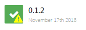
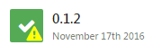

# Octopus Styles

A couple of Octopus Deploy CSS tweaks bundled together as an extension

This repository aims to kill two birds with one stone; it gives me an opportunity to build an Octopus Deploy extension whilst also providing a couple of minor UI tweaks that aim to improve the Octopus experience.

**Note**: You must be running version 3.5 or higher of Octopus to make use of extensions

## CSS changes
### Improve dashboard font
In version 3.4 of Octopus the font weighting was changed on the dashboard and some users (myself included) have since found it more difficult to read the deployment dates [[1]](https://help.octopusdeploy.com/discussions/problems/47286-dashboard-font) [[2]](https://octopusdeploy.uservoice.com/forums/170787-general/suggestions/15819517-change-the-fonts-in-the-3-4-dashboard).

| Before                                        | After |
| ------                                        | ----- |
|  | 

### Make "Deployment Success With Warnings" icon more obvious
When a deployment completes but encounters a warning an exclamation is added to the success icon. This is not all that obvious [[3]](https://github.com/OctopusDeploy/Issues/issues/1888). The Octopus team are planning on enhancing this to be configurable to show a warning as yellow or green but this extension will show it as yellow in the meantime.

| Before                                        | After |
| ------                                        | ----- |
|  | 

### All together now

Just in case you're wondering what both of the above look like together

| Before                                        | After |
| ------                                        | ----- |
|  | 

## Building and installing the extension

Clone the repository (or download the latest zip)
~~~
git clone https://github.com/rh072005/octopus-styles.git
~~~

Change to the cloned repository
~~~
cd octopus-styles
~~~

Build the repository (it uses [Cake](http://cakebuild.net/)) - This builds OctopusStyles.dll to an artifacts folder in the root of the repository
~~~
cake
~~~

To install the extension you'll need to copy OctopusStyles.dll to %ProgramData%\Octopus\CustomExtensions

You will have to restart your Octopus Server service using Octopus Manager to load the new extension

To verify that the extension has been loaded go to Octopus --> Configuration --> Diagnostics and the list of loaded extensions appear on the right hand side.

To uninstall the module simply delete OctopusStyles.dll from the CustomExtensions folder and restart the Octopus Server.

For further installation information see the Octopus documentation at [http://docs.octopusdeploy.com/display/OD/Installing+a+custom+server+extension](http://docs.octopusdeploy.com/display/OD/Installing+a+custom+server+extension)
